<div align="center">


<br>


**A [Model Context Protocol](https://modelcontextprotocol.io) server that gives any MCP-capable AI coding agent — Claude Code, Codex, Cursor, Windsurf, Cline, … — safe, structured read/write access to an [Obsidian](https://obsidian.md) vault, and turns YouTube videos into beautifully structured, cross-linked notes.**

[Install](#-install) · [Features](#-features) · [See it in action](#-see-it-in-action) · [Tools](#-tools) · [The pipeline](#-the-process-youtube-pipeline) · [Quick start](#-quick-start) · [Architecture](#-architecture) · [Roadmap](#-roadmap)

</div>

---

## 📦 Install

An MCP server isn't a global install — **each user registers it once in their own MCP client.** The first two steps are the same for every client:

```bash
git clone https://github.com/zenobioscastillo1-source/obsidian-knowledge-pipeline
cd obsidian-knowledge-pipeline
uv sync                          # install dependencies
# then set VAULT_PATH in .env to your Obsidian vault's root folder
```

Then register it with your agent — pick your client:

```bash
# Claude Code
claude mcp add obsidian-knowledge-pipeline -- uv --directory "$PWD" run python server.py

# Codex CLI (recent versions; or add the [mcp_servers] block in ~/.codex/config.toml — see Quick start)
codex mcp add obsidian-knowledge-pipeline -- uv --directory "$PWD" run python server.py
```

After restarting your client, **11 tools** (4 vault · 2 YouTube · 3 screenshot · 2 canvas) are available. The **3 prompts** (`/process-youtube`, `/analyze-voice`, `/build-canvas`) appear as slash commands in clients that surface MCP prompts (Claude Code, Claude Desktop); in clients that don't yet (e.g. Codex today), drive the same workflows by asking the agent to use the tools. Using Cursor, Windsurf, the MCP Inspector, or plain pip? See [Quick start](#-quick-start). *(`$PWD` works in bash/zsh; on Windows PowerShell use the folder's absolute path.)*

> **Why it's portable:** the server speaks plain MCP over stdio with no provider SDK and no API keys — nothing in it is tied to a specific model or vendor. Any MCP-capable agent that can launch a local stdio server can run it.

---

## ✨ Features

<table>
<tr>
<td width="50%" valign="top">

**🎬 YouTube extraction**
Pull a video's full transcript (with language fallback) and its title/channel/thumbnail — via the public oEmbed endpoint. **No API key.**

</td>
<td width="50%" valign="top">

**🗂️ Safe vault I/O**
Search, read, create, and list notes — every path funnelled through one guard so access never escapes your `VAULT_PATH`.

</td>
</tr>
<tr>
<td width="50%" valign="top">

**🧩 One-prompt pipeline**
The `process-youtube` prompt drives the whole flow: extract → analyze → write a full, cross-linked note set into your vault.

</td>
<td width="50%" valign="top">

**🎨 Inline SVG diagrams**
Every module gets a hand-styled diagram inside an Obsidian callout — hub-and-spoke, stacks, journeys, comparisons.

</td>
</tr>
<tr>
<td width="50%" valign="top">

**🏷️ Tag deduplication**
Scans `3 - Tags` first and reuses existing concepts, only creating stubs for genuinely new ones — italic `*tags:*` wikilinks, not hashtags.

</td>
<td width="50%" valign="top">

**📊 Theme Bases**
The index is a native **Obsidian Base** per theme — grouped by source, auto-collecting every future note you process under that theme.

</td>
</tr>
<tr>
<td width="50%" valign="top">

**🗣️ Write in your voice**
Opt in and the pipeline analyzes samples of your own writing into a reusable **Voice Profile**, then writes notes in your tone, rhythm, and diction. Decline and it uses the default house style.

</td>
<td width="50%" valign="top">

**♻️ Analyze once, reuse**
The Voice Profile is saved to your vault once and reused on every future run (refresh anytime with the `analyze-voice` prompt). Voice shapes tone only — structure, tables, SVGs, and tags stay intact.

</td>
</tr>
<tr>
<td width="50%" valign="top">

**🗺️ Canvas maps**
The `build-canvas` prompt turns a whole topic folder into a zoomed-out **Obsidian Canvas** — colour-coded Group columns of essence cards, joined by a left → right spine. See the subject whole.

</td>
<td width="50%" valign="top">

**📸 Visual capture**
Pull HD images out of your sources — `capture_pdf_page` for PDFs and `get_youtube_frames` for video — saved to the vault with a ready-to-paste, timestamped embed.

</td>
</tr>
</table>

---

## 🖼️ See it in action

What the pipeline actually produces in your vault. Most panels pair a quick **schematic** (how it works) with a **real screenshot** from a live vault below it — not mockups of a different app, but the exact artifacts each run leaves behind.

### 🎨 A graph view, colour-graded by group

The pipeline writes a graph colour-group config, so every kind of note glows its own colour. Themes, source overviews, modules, and tag concepts each get a hue — and because modules share tags, clusters form on their own.

<div align="center">
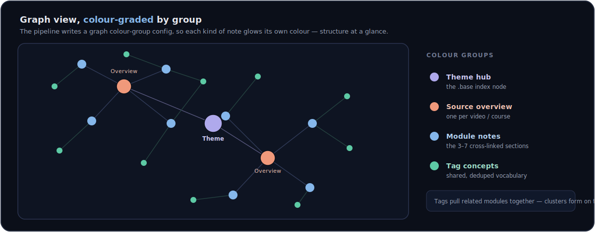
<br><br>
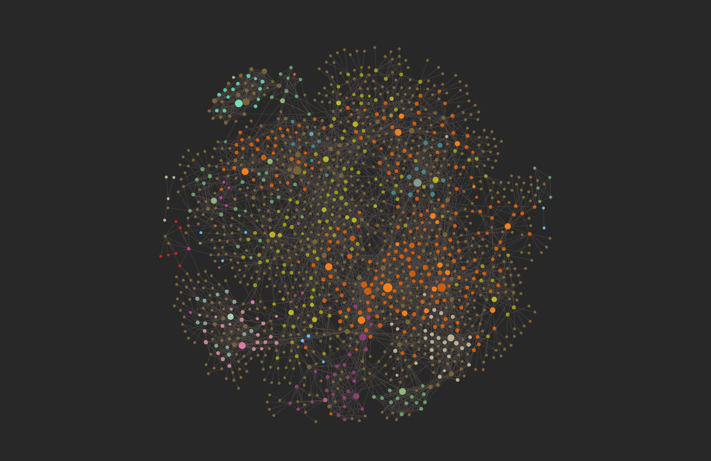
<br>
<sub><i>↑ The real thing — a live vault of ~1,000 notes, each coloured by its group.</i></sub>
</div>

### 📊 Indexing with a live Obsidian Base

Each theme gets one `<Theme>.base` — a saved query that filters on `theme`, groups every note by `source`, and shows each module's `summary`. Created once; every future video under that theme drops into the index on its own.

<div align="center">
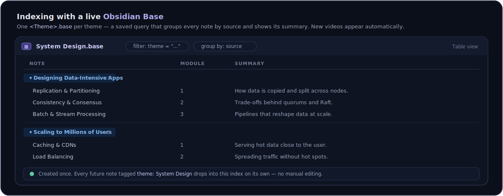
<br><br>
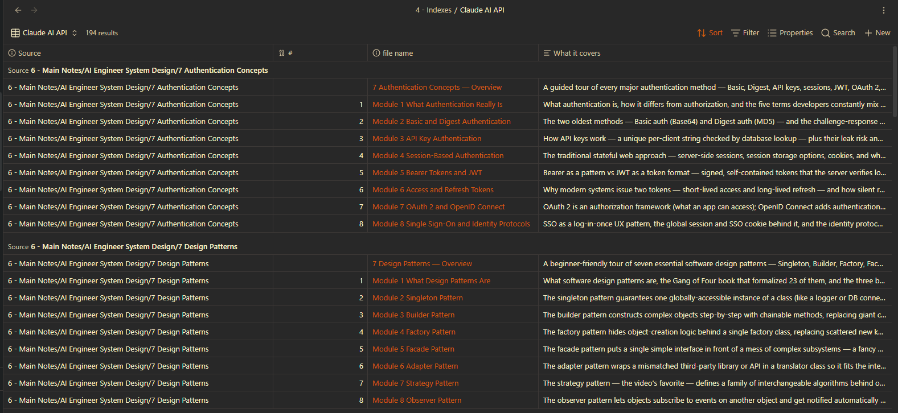
<br>
<sub><i>↑ The real thing — a <code>Claude AI API</code> base, 194 notes grouped by source with a “what it covers” column.</i></sub>
</div>

### 🏷️ A Tags folder that explains itself

Tags here aren't hashtags — each is a real note that **defines the concept**, with aliases and links. The pipeline scans `3 - Tags` first and reuses what's there, only stubbing genuinely new ideas, so the vocabulary stays shared and deduped.

<div align="center">
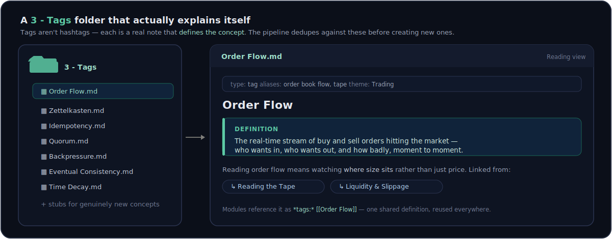
<br><br>
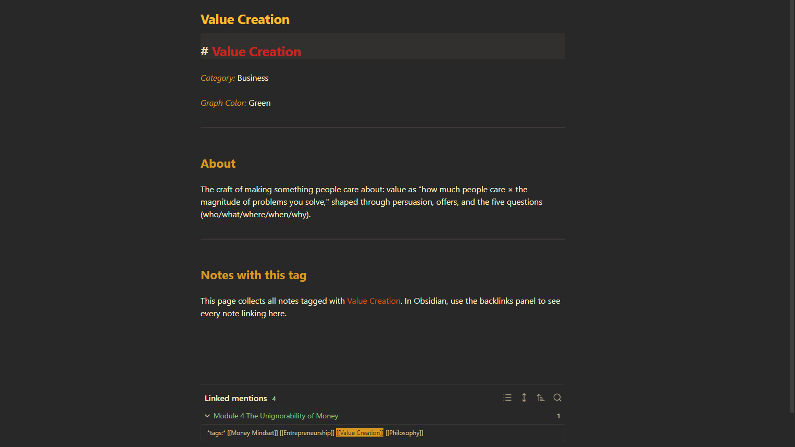
<br>
<sub><i>↑ The real thing — the <code>Value Creation</code> tag note: a definition, its graph colour, and linked mentions from the modules that use it.</i></sub>
</div>

### 🗺️ A whole topic on one Canvas

`build-canvas` clusters a folder into colour-coded Group columns of essence cards — each a clickable `[[wikilink]]` plus a faithful, auto-sized summary — joined by a left → right spine that follows the source's own parts. Zoom out (Shift+1) and see the subject whole.

<div align="center">
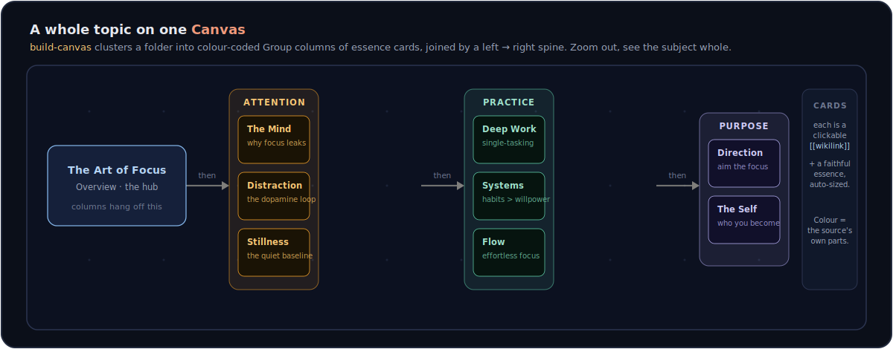
<br><br>
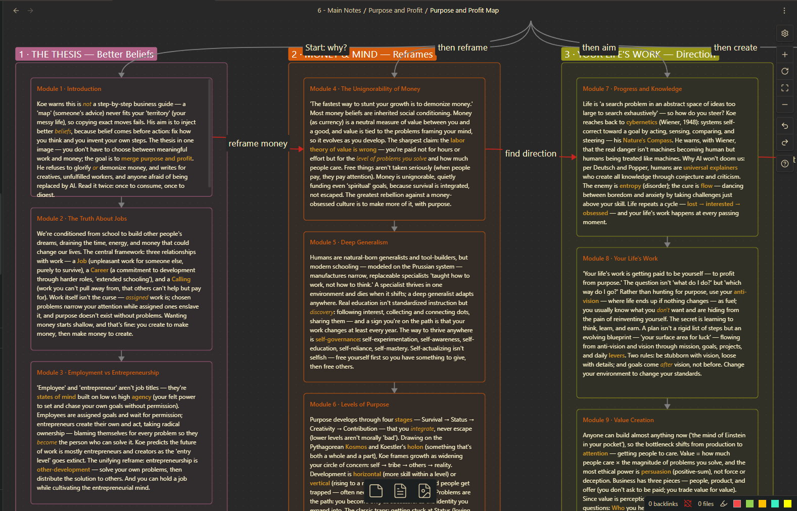
<br>
<sub><i>↑ The real thing — Dan Koe's <i>Purpose &amp; Profit</i> mapped into three columns: <b>reframe money → find direction → create</b>.</i></sub>
</div>

### 🗣️ Notes written in your own voice

Drop a few of your own writings in once; `analyze-voice` distils them into a reusable Voice Profile. After that every note sounds like you — same facts, your tone and rhythm — while the structure (frontmatter, tables, SVGs, tags, footnotes) stays exactly as specified.

<div align="center">
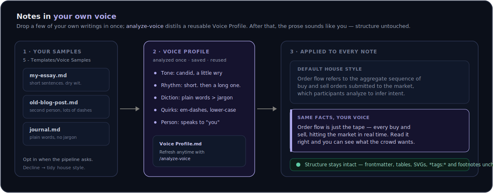
</div>

### 🎞️ The frames that matter, pulled from a video

`get_youtube_frames` samples a video at scene-changes (or a fixed interval), saves each frame HD to the vault, and hands back a timestamped embed — full-res for you to read, a downscaled copy for the model to caption cheaply.

<div align="center">
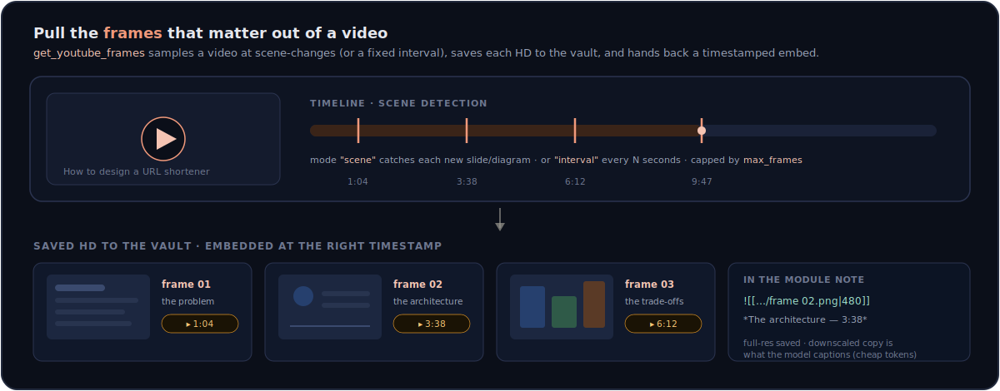
<br><br>
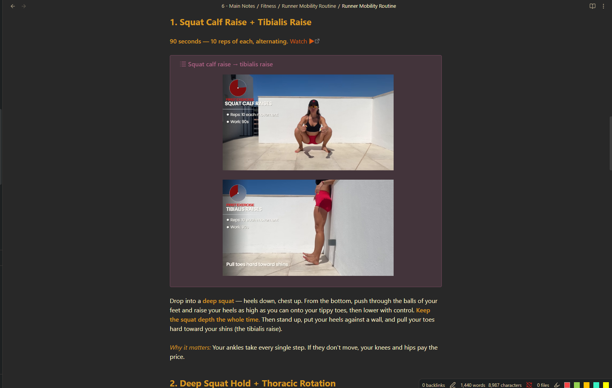
<br>
<sub><i>↑ The real thing — captured frames embedded step-by-step in a <code>Runner Mobility Routine</code> note, right above the instructions they illustrate.</i></sub>
</div>

---

## 🔧 Tools

### Vault

| Tool | What it does | Parameters |
| --- | --- | --- |
| `search_vault` | Find notes by filename, or by content | `query` *(required)*; `folder`, `search_content` *(default `false`)*, `max_results` *(default `10`)* |
| `read_note` | Read a note's full content + metadata | `path` *(required)* |
| `create_note` | Create a note, making parent folders as needed | `path`, `content` *(required)*; `overwrite` *(default `false`)* |
| `list_folder` | List files and subfolders of a vault directory | `path` *(default `""` = vault root)*; `recursive` *(default `false`)* |

All vault paths are **relative to the vault root** (e.g. `3 - Tags/Zettelkasten.md`). Anything that tries to escape the vault (absolute paths, `..`, symlinks pointing outside) is rejected.

### YouTube

| Tool | What it does | Parameters |
| --- | --- | --- |
| `get_youtube_transcript` | Extract a video's transcript (timed segments + concatenated text) | `url` *(required)*; `language` *(default `"en"`, falls back to the first available, preferring human-made captions)* |
| `get_youtube_metadata` | Fetch a video's title, channel name + URL, and thumbnail | `url` *(required)* |

`url` accepts any common form (`watch?v=`, `youtu.be/`, `embed/`, `shorts/`, with extra `&t=` / `&list=` params).

### Screenshots (visual capture)

For visual learners (medical students, artists, anyone who learns from diagrams): turn **a part of a source** into an HD image saved in the vault and ready to embed in the matching note. The full-resolution image is saved for the reader; a downscaled copy is what the model sees (accurate captions, lower token cost). Each saved image comes with an Obsidian `embed` snippet that names **where in the source** it came from (page number / timestamp).

| Tool | What it does | Parameters |
| --- | --- | --- |
| `capture_pdf_page` | Render PDF page(s) — or a cropped region of a page — to an HD PNG | `pdf_path` *(required; absolute path or vault-relative)*; `pages` *(default `"1"`, e.g. `"12-14"` / `"3,5,9"`)*, `source_name`, `region` *(`"x0,y0,x1,y1"` fractions)*, `dpi` *(default `300`)*, `page_label_offset` *(default `0`)*, `analysis_width` *(default `1024`)*, `embed_width` *(default `480`)*, `save` *(default `true`)*, `return_images` *(default `true`)* |
| `get_youtube_frames` | Sample frames from a video (scene-change or fixed interval) | `url` *(required)*; `mode` *(`"scene"` / `"interval"`)*, `interval_seconds` *(default `30`)*, `scene_threshold` *(default `0.4`)*, `max_frames` *(default `12`)*, `start`, `end`, `source_name`, `analysis_width`, `embed_width`, `save`, `return_images` |
| `crop_screenshot` | Crop an already-saved screenshot to just the part you want (fix a capture without re-rendering) | `image_path` *(required; the `saved_path` a capture returned)*, `region` *(required; `"x0,y0,x1,y1"` fractions to KEEP)*; `replace` *(default `false` → writes `"<name> cropped.png"`)*, `analysis_width`, `embed_width`, `return_image` |

Images save to one central folder (default `2 - Source Material/Screenshots`, override with the `SCREENSHOTS_FOLDER` env var). Each saved image returns an Obsidian `embed` snippet sized to `embed_width` (`![[img|480]]`) so it appears as a readable thumbnail rather than taking over the note — the saved file stays full resolution (click to enlarge). Captions use the **printed page number** when the PDF embeds page labels (so `p.35` matches the book, not the raw PDF index); for label-less PDFs, set `page_label_offset` to align them (e.g. `-12`). `capture_pdf_page` and `crop_screenshot` are pure Python (PyMuPDF / Pillow) and need no system binaries. `get_youtube_frames` uses `yt-dlp` + `ffmpeg`; both install with the package — `imageio-ffmpeg` ships a static ffmpeg binary, so **no separate ffmpeg install is required** (a system `ffmpeg` on `PATH` is used in preference if you have one).

### Canvas

Turn a folder of notes into a holistic **Obsidian Canvas** map. The tool owns the layout maths (column geometry, card auto-sizing, the spine edges); the model owns the intelligence (how to cluster the notes, what to call each region). Drive it with the [`build-canvas`](#-the-process-youtube-pipeline) prompt.

| Tool | What it does | Parameters |
| --- | --- | --- |
| `create_canvas` | Write a `.canvas` from an index hub + colour-coded Group columns of essence cards, auto-laying out positions, sizes, and spine edges | `path`, `title`, `columns` *(required)*; `subtitle`, `index_note`, `links` |
| `read_canvas` | Read a `.canvas` back as parsed JSON + a short summary (since `read_note` only accepts `.md`) | `path` *(required)* |

Each column is `{label, color, question, notes:[{file, id, summary}]}`; colours follow Obsidian's Canvas palette (`"1"` red … `"6"` purple) and adjacent columns differ. Every note path must already exist — the tool refuses to point a card at a missing file.

---

## 🚀 The `process-youtube` pipeline

One MCP **prompt** orchestrates the tools into a full video → vault workflow.

<div align="center">

</div>

It splits the transcript into 3–7 cross-linked **modules** (each with an SVG diagram, beginner-friendly rewrites, tables, and italic `*tags:*` wikilinks), writes a per-source **overview note**, dedupes and creates **tag stubs**, and maintains a per-theme **Obsidian Base** index.

| Argument | Required | Description |
| --- | --- | --- |
| `url` | ✅ | YouTube video URL |
| `theme` | — | Theme that groups this note's Base (e.g. `AI`, `Trading`). **Inferred from the video if omitted.** |
| `topic_name` | — | Source/course title (used as the `source` property + overview note name). Derived from the video title if omitted. |
| `target_folder` | — | Subfolder within `6 - Main Notes` (defaults to the source title). |
| `voice` | — | `mine` to write in your own voice (see `analyze-voice`), `default` for the house style. **Leave blank to be asked.** |

> **Where it lands:** module notes + a `<Source> — Overview` note in `6 - Main Notes/`, new concept stubs in `3 - Tags/`, and a **`<Theme>.base`** in `4 - Indexes/`. Each note carries YAML frontmatter (`theme`, `source`, `type`, `module`, `summary`); the theme Base filters on `theme`, groups by `source`, and shows each module's `summary`. Because a Base is a live query, it's created **once** and every future video under that theme appears in it automatically.

In Claude Code or Claude Desktop, invoke it as a prompt/slash command (e.g. `/process-youtube`) and supply the URL.

**Two companion prompts** round out the workflow: `analyze-voice` builds (or refreshes) the reusable Voice Profile the pipeline writes in, and `build-canvas` turns an already-processed topic folder into a zoomed-out [Canvas map](#-a-whole-topic-on-one-canvas).

---

## 🏁 Quick start

Dependencies are managed with [uv](https://docs.astral.sh/uv/).

```powershell
uv sync
```

> Prefer plain pip? `python -m venv .venv; .\.venv\Scripts\Activate.ps1; pip install -r requirements.txt`

**Point it at your vault** — open `.env` and set the absolute path to your Obsidian vault root:

```
VAULT_PATH=D:\Obsidian\My Vault
```

No quotes needed even with spaces; `.env` is git-ignored. On macOS/Linux use a forward-slash path.

<details>
<summary><b>Optional: ignore personal folders</b></summary>

<br>

Top-level folders that aren't part of the pipeline can be hidden from `list_folder`, `search_vault`, and processing. Set `IGNORED_FOLDERS` in `.env` (comma-separated); it defaults to `7 - File Vault, 8 - Quests`. Ignored folders are skipped in sweeps but still reachable if you target one directly.

</details>

### Try it in the MCP Inspector

```powershell
uv run mcp dev server.py
```

Opens a browser UI (needs **Node.js / npx** on your PATH). Try `list_folder` with no arguments, or open the **Prompts** tab to run `process-youtube`.

### Connect to Claude Code

```powershell
claude mcp add obsidian-knowledge-pipeline -- uv --directory "ABSOLUTE\PATH\TO\obsidian-knowledge-pipeline" run python server.py
```

<details>
<summary><b>Connect to Claude Desktop</b></summary>

<br>

Add to `claude_desktop_config.json` (**Windows:** `%APPDATA%\Claude\…`, **macOS:** `~/Library/Application Support/Claude/…`):

```json
{
  "mcpServers": {
    "obsidian-knowledge-pipeline": {
      "command": "uv",
      "args": ["--directory", "ABSOLUTE/PATH/TO/obsidian-knowledge-pipeline", "run", "python", "server.py"]
    }
  }
}
```

If `uv` isn't on Claude Desktop's PATH, point `command` straight at `.venv/Scripts/python.exe` (Windows) or `.venv/bin/python` (macOS/Linux) with `server.py` as the only arg. Restart Claude Desktop after saving.

</details>

### Connect to Codex

Recent Codex CLI versions accept the same one-liner as Claude Code:

```powershell
codex mcp add obsidian-knowledge-pipeline -- uv --directory "ABSOLUTE\PATH\TO\obsidian-knowledge-pipeline" run python server.py
```

<details>
<summary><b>Or edit <code>~/.codex/config.toml</code> by hand</b></summary>

<br>

```toml
[mcp_servers.obsidian-knowledge-pipeline]
command = "uv"
args = ["--directory", "ABSOLUTE/PATH/TO/obsidian-knowledge-pipeline", "run", "python", "server.py"]
```

If `uv` isn't on Codex's PATH, point `command` at `.venv/Scripts/python.exe` (Windows) or `.venv/bin/python` (macOS/Linux) with `server.py` as the only `args` entry. Codex currently surfaces the **tools**; run the `process-youtube` / `analyze-voice` / `build-canvas` workflows by asking the agent to use them (the prompt logic lives server-side, so the tool calls are identical).

</details>

### Connect to any other MCP client

Cursor, Windsurf, Cline, Zed and similar all register a local stdio server the same way — a `command` plus `args`. Use the same launch command everywhere:

```
command: uv
args:    ["--directory", "ABSOLUTE/PATH/TO/obsidian-knowledge-pipeline", "run", "python", "server.py"]
```

(or `.venv/Scripts/python.exe` / `.venv/bin/python` with `server.py` if `uv` isn't on the client's PATH). Drop that into the client's MCP config in whatever shape it expects (JSON, TOML, or a UI form) and restart it.

---

## 🏗️ Architecture

<div align="center">

</div>

Every tool resolves its `path` through `config.resolve_in_vault()` — the single security choke point that rejects absolute paths, resolves `..`/symlinks, and confirms the result is still inside `VAULT_PATH`. Tools return plain JSON and report problems as `{"error": "…"}` instead of crashing, so the client always gets a useful answer.

```
obsidian-knowledge-pipeline/
├── server.py                  # FastMCP entry point — registers tools + prompts, runs over stdio
├── config.py                  # VAULT_PATH + resolve_in_vault() path guard + ignore-list + screenshots/voice folders
├── tools/
│   ├── vault.py               # search_vault · read_note · create_note · list_folder
│   ├── youtube.py             # get_youtube_transcript · get_youtube_metadata
│   ├── screenshots.py         # capture_pdf_page · get_youtube_frames · crop_screenshot (HD images → vault)
│   └── canvas.py              # create_canvas · read_canvas (layout maths for .canvas maps)
├── prompts/
│   ├── process_youtube.py     # the process-youtube prompt template (incl. the voice step)
│   ├── voice.py               # analyze-voice prompt + reusable Voice Profile spec
│   └── canvas.py              # build-canvas prompt (cluster a folder into a Canvas map)
├── assets/                    # README diagrams (SVG)
├── .env                       # VAULT_PATH=…  (git-ignored)
├── pyproject.toml             # deps (uv)   ·   requirements.txt (pip / Inspector)
└── obsidian-mcp-spec.md       # full design spec
```

---

## 🗺️ Roadmap

- ✅ **Phase 1** — vault read/write tools
- ✅ **Phase 2** — YouTube transcript + metadata extraction
- ✅ **Phase 3** — the `process-youtube` prompt → structured notes + per-theme Obsidian Base index
- ✅ **Phase 5** — screenshot / visual capture: `capture_pdf_page` (PDFs, pure Python) + `get_youtube_frames` (video; ffmpeg bundled via imageio-ffmpeg), saving HD images to the vault for visual learners (see [the spec](obsidian-mcp-spec.md))
- ✅ **Voice** — opt-in [Voice Profile](#-notes-written-in-your-own-voice): `analyze-voice` learns your writing once and the pipeline reuses it on every run (tone only — structure stays intact)
- ✅ **Canvas** — `build-canvas` + `create_canvas` / `read_canvas` turn a topic folder into a holistic [Canvas map](#-a-whole-topic-on-one-canvas), with optional reader-subagent fan-out for large folders
- 📇 **Registry-ready** — a [`server.json`](server.json) scaffold for the [official MCP registry](https://github.com/modelcontextprotocol/registry) is included; listing there also needs a PyPI release + namespace auth via the `mcp-publisher` CLI

---

## 📄 License

[MIT](LICENSE) © Zenobios Castillo

<div align="center">
<sub>Built with the official <a href="https://github.com/modelcontextprotocol/python-sdk">MCP Python SDK</a> · FastMCP · stdio</sub>
</div>
