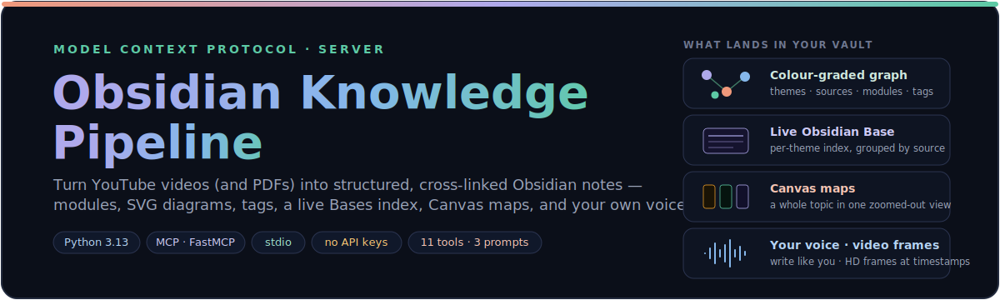
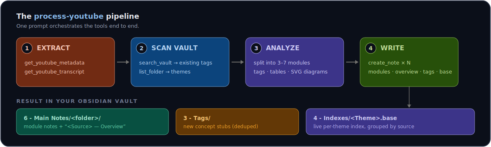
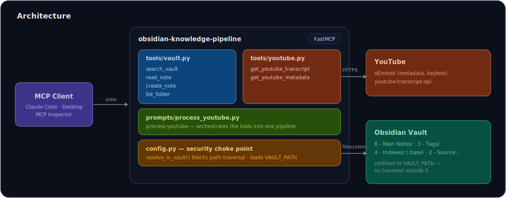

<div align="center">



<br>


**A [Model Context Protocol](https://modelcontextprotocol.io) server that gives Claude safe, structured read/write access to an [Obsidian](https://obsidian.md) vault — and turns YouTube videos into beautifully structured, cross-linked notes.**

[Features](#-features) · [Tools](#-tools) · [The pipeline](#-the-process-youtube-pipeline) · [Quick start](#-quick-start) · [Architecture](#-architecture) · [Roadmap](#-roadmap)

</div>

---

## ✨ Features

<table>
<tr>
<td width="50%" valign="top">

**🎬 YouTube extraction**
Pull a video's full transcript (with language fallback) and its title/channel/thumbnail — via the public oEmbed endpoint. **No API key.**

</td>
<td width="50%" valign="top">

**🗂️ Safe vault I/O**
Search, read, create, and list notes — every path funnelled through one guard so access never escapes your `VAULT_PATH`.

</td>
</tr>
<tr>
<td width="50%" valign="top">

**🧩 One-prompt pipeline**
The `process-youtube` prompt drives the whole flow: extract → analyze → write a full, cross-linked note set into your vault.

</td>
<td width="50%" valign="top">

**🎨 Inline SVG diagrams**
Every module gets a hand-styled diagram inside an Obsidian callout — hub-and-spoke, stacks, journeys, comparisons.

</td>
</tr>
<tr>
<td width="50%" valign="top">

**🏷️ Tag deduplication**
Scans `3 - Tags` first and reuses existing concepts, only creating stubs for genuinely new ones — italic `*tags:*` wikilinks, not hashtags.

</td>
<td width="50%" valign="top">

**📊 Theme Bases**
The index is a native **Obsidian Base** per theme — grouped by source, auto-collecting every future note you process under that theme.

</td>
</tr>
</table>

---

## 🔧 Tools

### Vault

| Tool | What it does | Parameters |
| --- | --- | --- |
| `search_vault` | Find notes by filename, or by content | `query` *(required)*; `folder`, `search_content` *(default `false`)*, `max_results` *(default `10`)* |
| `read_note` | Read a note's full content + metadata | `path` *(required)* |
| `create_note` | Create a note, making parent folders as needed | `path`, `content` *(required)*; `overwrite` *(default `false`)* |
| `list_folder` | List files and subfolders of a vault directory | `path` *(default `""` = vault root)*; `recursive` *(default `false`)* |

All vault paths are **relative to the vault root** (e.g. `3 - Tags/Zettelkasten.md`). Anything that tries to escape the vault (absolute paths, `..`, symlinks pointing outside) is rejected.

### YouTube

| Tool | What it does | Parameters |
| --- | --- | --- |
| `get_youtube_transcript` | Extract a video's transcript (timed segments + concatenated text) | `url` *(required)*; `language` *(default `"en"`, falls back to the first available, preferring human-made captions)* |
| `get_youtube_metadata` | Fetch a video's title, channel name + URL, and thumbnail | `url` *(required)* |

`url` accepts any common form (`watch?v=`, `youtu.be/`, `embed/`, `shorts/`, with extra `&t=` / `&list=` params).

---

## 🚀 The `process-youtube` pipeline

One MCP **prompt** orchestrates the tools into a full video → vault workflow.

<div align="center">

</div>

It splits the transcript into 3–7 cross-linked **modules** (each with an SVG diagram, beginner-friendly rewrites, tables, and italic `*tags:*` wikilinks), writes a per-source **overview note**, dedupes and creates **tag stubs**, and maintains a per-theme **Obsidian Base** index.

| Argument | Required | Description |
| --- | --- | --- |
| `url` | ✅ | YouTube video URL |
| `theme` | — | Theme that groups this note's Base (e.g. `AI`, `Trading`). **Inferred from the video if omitted.** |
| `topic_name` | — | Source/course title (used as the `source` property + overview note name). Derived from the video title if omitted. |
| `target_folder` | — | Subfolder within `6 - Main Notes` (defaults to the source title). |

> **Where it lands:** module notes + a `<Source> — Overview` note in `6 - Main Notes/`, new concept stubs in `3 - Tags/`, and a **`<Theme>.base`** in `4 - Indexes/`. Each note carries YAML frontmatter (`theme`, `source`, `type`, `module`, `summary`); the theme Base filters on `theme`, groups by `source`, and shows each module's `summary`. Because a Base is a live query, it's created **once** and every future video under that theme appears in it automatically.

In Claude Code or Claude Desktop, invoke it as a prompt/slash command (e.g. `/process-youtube`) and supply the URL.

---

## 🏁 Quick start

Dependencies are managed with [uv](https://docs.astral.sh/uv/).

```powershell
uv sync
```

> Prefer plain pip? `python -m venv .venv; .\.venv\Scripts\Activate.ps1; pip install -r requirements.txt`

**Point it at your vault** — open `.env` and set the absolute path to your Obsidian vault root:

```
VAULT_PATH=D:\Obsidian\My Vault
```

No quotes needed even with spaces; `.env` is git-ignored. On macOS/Linux use a forward-slash path.

<details>
<summary><b>Optional: ignore personal folders</b></summary>

<br>

Top-level folders that aren't part of the pipeline can be hidden from `list_folder`, `search_vault`, and processing. Set `IGNORED_FOLDERS` in `.env` (comma-separated); it defaults to `7 - File Vault, 8 - Quests`. Ignored folders are skipped in sweeps but still reachable if you target one directly.

</details>

### Try it in the MCP Inspector

```powershell
uv run mcp dev server.py
```

Opens a browser UI (needs **Node.js / npx** on your PATH). Try `list_folder` with no arguments, or open the **Prompts** tab to run `process-youtube`.

### Connect to Claude Code

```powershell
claude mcp add obsidian-knowledge-pipeline -- uv --directory "ABSOLUTE\PATH\TO\obsidian-knowledge-pipeline" run python server.py
```

<details>
<summary><b>Connect to Claude Desktop</b></summary>

<br>

Add to `claude_desktop_config.json` (**Windows:** `%APPDATA%\Claude\…`, **macOS:** `~/Library/Application Support/Claude/…`):

```json
{
  "mcpServers": {
    "obsidian-knowledge-pipeline": {
      "command": "uv",
      "args": ["--directory", "ABSOLUTE/PATH/TO/obsidian-knowledge-pipeline", "run", "python", "server.py"]
    }
  }
}
```

If `uv` isn't on Claude Desktop's PATH, point `command` straight at `.venv/Scripts/python.exe` (Windows) or `.venv/bin/python` (macOS/Linux) with `server.py` as the only arg. Restart Claude Desktop after saving.

</details>

---

## 🏗️ Architecture

<div align="center">

</div>

Every tool resolves its `path` through `config.resolve_in_vault()` — the single security choke point that rejects absolute paths, resolves `..`/symlinks, and confirms the result is still inside `VAULT_PATH`. Tools return plain JSON and report problems as `{"error": "…"}` instead of crashing, so the client always gets a useful answer.

```
obsidian-knowledge-pipeline/
├── server.py                  # FastMCP entry point — registers tools + prompt, runs over stdio
├── config.py                  # VAULT_PATH + resolve_in_vault() path guard + ignore-list
├── tools/
│   ├── vault.py               # search_vault · read_note · create_note · list_folder
│   └── youtube.py             # get_youtube_transcript · get_youtube_metadata
├── prompts/
│   └── process_youtube.py     # the process-youtube prompt template
├── assets/                    # README diagrams (SVG)
├── .env                       # VAULT_PATH=…  (git-ignored)
├── pyproject.toml             # deps (uv)   ·   requirements.txt (pip / Inspector)
└── obsidian-mcp-spec.md       # full design spec
```

---

## 🗺️ Roadmap

- ✅ **Phase 1** — vault read/write tools
- ✅ **Phase 2** — YouTube transcript + metadata extraction
- ✅ **Phase 3** — the `process-youtube` prompt → structured notes + per-theme Obsidian Base index
- 🔭 **Drafted** — `get_youtube_frames`, so Claude can *watch* a video's keyframes (see [the spec](obsidian-mcp-spec.md))

---

## 📄 License

[MIT](LICENSE) © Zenobios Castillo

<div align="center">
<sub>Built with the official <a href="https://github.com/modelcontextprotocol/python-sdk">MCP Python SDK</a> · FastMCP · stdio</sub>
</div>
